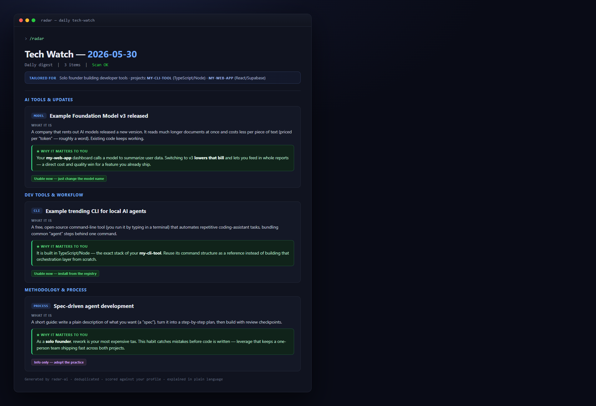

# radar

**Your daily tech-watch, scored and actionable — as a Claude Code skill.**

Turn any list of sources into a deduplicated, prioritized Markdown digest. Multi-domain, config-driven, zero hardcoded paths.

[](LICENSE)
[](https://docs.claude.com/en/docs/claude-code)
[](CONTRIBUTING.md)
[](https://github.com/Samdev2420/radar-ai/actions)

## Demo



*radar reads your `sources.yml`, scans each source, deduplicates against the running index, scores the results, and writes a clean Markdown digest.*

## Quick start

Three commands inside Claude Code:

```text
/plugin marketplace add Samdev2420/radar-ai
/plugin install radar
/radar
```

The first two install the plugin; `/radar` runs your first digest once you have declared your sources. See [docs/installation.md](docs/installation.md) for manual install and source setup.

## Why

Keeping up with a fast-moving domain usually means one of two bad options: skim a dozen tabs every morning, or fall behind. radar gives you a third option — declare your sources once, then run a single command to get a short, scored, actionable digest in under a minute.

It is built for staying current in less than 24 hours without spending hours doing it. radar does not assume any topic: AI, crypto, biotech, design — if it has a URL or a search query, radar can watch it.

## Example sources

Sources live in a single YAML file. Each one declares a `method`: `webfetch` (read a page), `websearch` (run a query), or `github_trending` (scan trending repos).

```yaml
sources:
  # Read a specific page.
  - name: Anthropic News
    method: webfetch
    url: https://www.anthropic.com/news
    priority: high          # high | medium | low (optional)
    tags: [ai, claude]

  # Run a web search query.
  - name: Claude feature updates
    method: websearch
    query: "Claude new feature update"
    priority: medium
    tags: [ai]

  # Scan GitHub trending (daily).
  - name: GitHub Trending (daily)
    method: github_trending
    url: https://github.com/trending?since=daily
    priority: medium
    tags: [dev, oss]
```

Swap these for your own sources to watch any topic — the skill makes no assumptions about the domain. The full starter file is [config/sources.example.yml](config/sources.example.yml), and a sample output digest is in [examples/2026-05-30-digest-example.md](examples/2026-05-30-digest-example.md).

## Customization

radar reads a second file, `config/radar.config.yml`, where you control the output. You can tune:

- **Scoring** — how each item is ranked by relevance and impact.
- **Categories** — the sections your digest is organized into.
- **Language** — the language the digest is written in.
- **Output** — where digests and the dedup index are written.

Full field reference: [docs/configuration.md](docs/configuration.md).

## How it works

radar is opinionated about one thing: a tech-watch digest is only useful if it is short, scored, and actionable. The scan, dedup, scoring, and formatting pipeline is documented in [docs/methodology.md](docs/methodology.md).

For installation details, both as a plugin and manually, see [docs/installation.md](docs/installation.md).

## Roadmap

Not yet shipped — planned directions:

- **Scheduled generation** — run radar automatically on a cron schedule (for example via a `/schedule` integration) so the digest lands without you typing the command.
- **Output presets** — first-class export targets such as Notion and Obsidian, in addition to the Markdown file output available today.

These are ideas, not commitments. Feedback and contributions on the roadmap are welcome.

## License

radar is released under the [MIT License](LICENSE).

## Contributing

Contributions are welcome. Start with the [contributing guide](CONTRIBUTING.md) and the [code of conduct](CODE_OF_CONDUCT.md). For security issues, please use GitHub's private vulnerability reporting as described in the [security policy](SECURITY.md) — never email.
